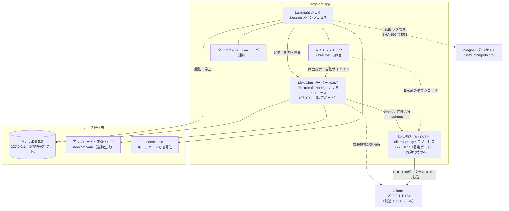
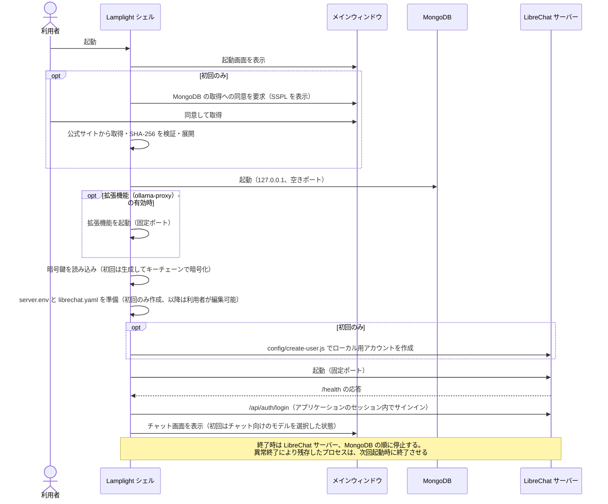
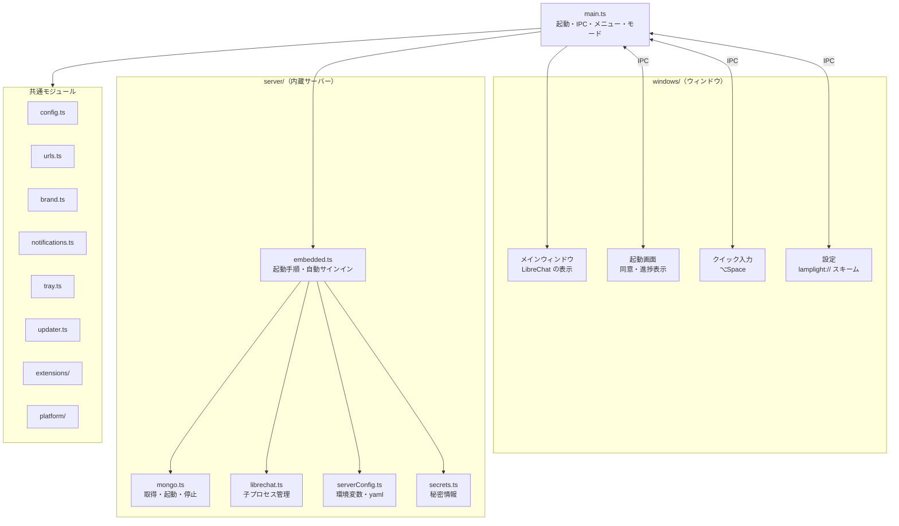
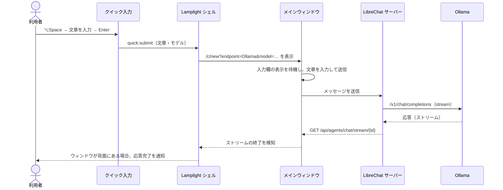
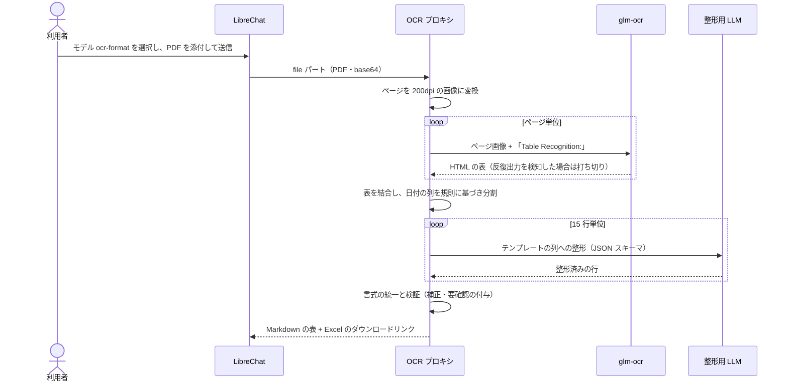
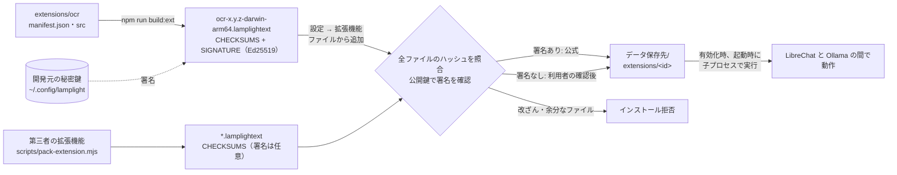
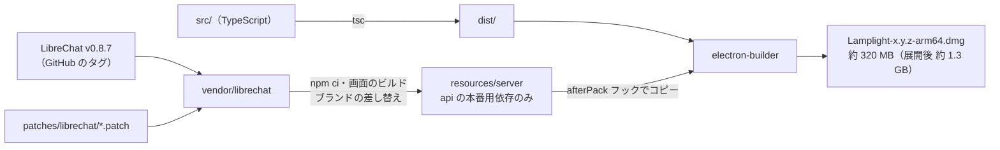

# システム構成

Lamplight は、LibreChat のサーバーを内蔵したデスクトップアプリケーションです。インストールのみで動作し、Docker は不要です。会話・ファイル・推論はすべて利用者のコンピューター内で処理し、外部の API にはデータを送信しません（OpenAI などのクラウドモデルを設定・選択した場合を除く）。

サーバーの動作モードは次の 2 種類です。

| モード | 内容 | 用途 |
| --- | --- | --- |
| **内蔵サーバー**（既定） | Lamplight が LibreChat サーバーと MongoDB を起動・停止する | 通常の利用。インストールのみで利用可能 |
| **外部サーバー** | 既存の LibreChat（Docker 環境や別のマシン）に接続する | 共有サーバー、または独自に構成した LibreChat の利用 |

## 構成要素

| 要素 | 役割 | 提供形態 |
| --- | --- | --- |
| **Lamplight シェル** | Electron のメインプロセス。ウィンドウ、クイック入力、メニューバー、通知、内蔵サーバーを管理する | アプリケーション本体（`app.asar`） |
| **LibreChat サーバー** | チャットの UI と API。v0.8.7 にパッチを適用してビルドしたもの | アプリケーションに同梱（`Contents/Resources/server`） |
| **MongoDB Community Server** 8.0 | 会話・ユーザー・設定の保存 | **同梱しない**。初回起動時に公式サイトから取得 |
| **Ollama** | ローカル LLM の実行 | **同梱しない**。利用者が別途インストール |
| **拡張機能** | 利用者が必要に応じて追加する機能。第三者も作成可能（[EXTENSIONS.md](EXTENSIONS.md)）。開発元の拡張機能として OCR（PDF の画像化、OCR、表の変換、`ocr-format`、Excel 出力）を提供 | 別途配布（`.lamplightext`。開発元の拡張機能は署名付き）。`extensions/ocr/` |

## 全体構成（内蔵サーバー）

- LibreChat サーバーと MongoDB は `127.0.0.1` のみで待ち受け、他の端末からは接続できません。
- LibreChat サーバーは、Electron 内蔵の Node.js（`ELECTRON_RUN_AS_NODE`）で実行します。Node.js を別途インストールする必要はありません。
- サーバーの環境変数は、LibreChat と同等の設定となるよう次の順に重ね合わせます。利用者のシェルの環境変数（`NODE_OPTIONS`、プロキシなど）は引き継ぎません。
  1. LibreChat の既定値（同梱の `.env.example`）。OpenAI・Anthropic・Google などは、API キーを画面から入力する設定（`user_provided`）となる
  2. Lamplight の既定値（タイトル、検索インデックスの無効化など）
  3. 利用者の `server.env`（LibreChat の `.env` に相当）
  4. 内蔵サーバーの必須値（アドレス、ポート、MongoDB、暗号鍵、保存先、新規登録の無効化）。常に最優先
- `librechat.yaml` は初回起動時に作成し（Ollama を登録）、以降は利用者が編集できます。
- アプリケーション内部は書き込み不可のため、アップロード・画像・ログはデータ保存先に書き込みます（パッチ `0001-writable-data-paths`）。
- 暗号鍵などの秘密情報は、キーチェーン（「Lamplight Safe Storage」）で暗号化して `secrets.bin` に保存します。キーチェーンの項目が失われて復号できない場合は、利用者の確認を経て `secrets.bin` を `secrets.bin.unreadable-<日時>` に退避し、鍵を再生成してローカル用アカウントのパスワードを再設定します（パッチ `0003-recover-local-account`）。会話は保持され、保存済みの API キーは再入力が必要です。
- 設定画面は、LibreChat の設定画面の「デスクトップ」「拡張機能」タブに統合しています。タブの内容は Lamplight の設定ページ（独自スキーム `lamplight://app/settings.html`）です。プリロードはこのページにのみアプリケーションの操作を公開し、LibreChat のページとその iframe（アーティファクトなど）には公開しません。メインプロセスも呼び出し元のフレームを検証します。外部サーバーモードと起動前は、同じページを別ウィンドウで表示します。
- `librechat.yaml` の Ollama エンドポイントには、受け付けるファイル形式として画像・PDF・`text/plain` を指定します。「テキストとしてアップロード」したファイルは `text/plain` として保存されるため、この指定がない場合、LibreChat は送信直前に添付を除外します。Ollama の OpenAI 互換 API は PDF の `file` パートを受け付けないため、PDF は「テキストとしてアップロード」で渡します。LibreChat v0.8.8 以降の添付の自動振り分けに備え、PDF を文字として渡す `defaultLLMDeliveryPath` も設定しています。v0.4 以前に作成された未編集の `librechat.yaml` は、起動時にこの設定へ更新します。

## 起動処理

- ポートを固定する理由は、ログイン状態（Cookie）と LibreChat の画面設定（テーマなど）が接続先ごとに保存されるためです。
- 初回起動時は、お気に入りのモデル、または Ollama のチャット向けモデル（OCR 用・埋め込み用を除く）の先頭を選択した状態でチャットを開きます。
- セッションが切れて LibreChat のログイン画面が表示された場合は、自動で再度サインインします。
- 利用可能になるまでの時間の目安は、初回が約 20 秒（MongoDB の取得を含む）、2 回目以降が約 3 秒です。

## アプリケーション内部構成

| モジュール | 役割 |
| --- | --- |
| `server/embedded.ts` | MongoDB の取得と起動、アカウントの作成、サーバーの起動、自動サインインを順に実行し、進捗を起動画面に通知する |
| `server/mongo.ts` | MongoDB 公式アーカイブの取得・検証・展開、起動と停止。Linux では `/etc/os-release` からディストリビューションに対応するビルドを選択する |
| `server/librechat.ts` | LibreChat サーバーの子プロセスの起動・ヘルスチェック・停止、保守用スクリプトの実行 |
| `server/serverConfig.ts` | サーバーに渡す環境変数と `librechat.yaml` の生成（単体テスト可能な純粋関数） |
| `server/secrets.ts` | 暗号鍵とローカル用アカウントのパスワードの生成、暗号化保存、復号不能時の検出 |
| `server/process.ts` | 空きポートの取得、起動待機、残存プロセスの終了 |
| `extensions/` | 拡張機能のマニフェスト検証、パッケージの照合と署名確認、インストール、子プロセスでの実行 |
| `updater.ts` | GitHub Releases からの自動アップデート（electron-updater） |
| `windows/mainWindow.ts` | LibreChat の表示、外部リンクの制御、名称とロゴの置き換え、クイック入力の送信 |
| `windows/appProtocol.ts` | `lamplight://app/` スキームによる Lamplight 自身の画面の配信と、IPC の呼び出し元フレームの判定 |
| `platform/` | OS ごとの差分（darwin・linux。Windows 対応時に `win32.ts` を追加） |

## 主要処理フロー

### クイック入力処理

LibreChat の URL パラメータ（`prompt`・`submit`）は使用しません。LibreChat（v0.8.7 で確認）は、新規チャットでモデルを適用する際に URL をエンドポイントとモデルのみに書き換えるため、文章が処理前に失われる場合があります。

### PDF の OCR・整形処理（`ocr-format`）

内蔵サーバーでは OCR 拡張機能が処理します。外部サーバーの場合は、[librechat-ocr-bridge](https://github.com/chiisanasoft/librechat-ocr-bridge) を組み込んだ LibreChat で同じ処理を利用できます。

## 拡張機能基盤

- 拡張機能は第三者も作成できます。インストール時に全ファイルを `CHECKSUMS` と照合し、改ざんされたファイル・余分なファイル・シンボリックリンクを含む場合は拒否します。
- Lamplight の署名鍵で署名されたものは「公式」と表示します。それ以外は「開発元未確認」と表示し、利用者の確認（警告ダイアログ）後にインストールします。
- 拡張機能は利用者の権限で動作するプログラムです。署名が保証するのは、Lamplight の開発元が配布したものであることのみです。
- マニフェストに `ocrService` を定義した拡張機能は、LibreChat の OCR サービスとしても動作します。Lamplight は `librechat.yaml` に `ocr:`（`strategy: mistral_ocr`、`baseURL: ${LAMPLIGHT_OCR_BASEURL}`）を目印付きの範囲で追加し、起動ごとに発行するトークンを LibreChat と拡張機能の双方に渡します。拡張機能は `127.0.0.1` で待ち受けるため、`ocr:` の `allowedAddresses` にそのアドレスを登録し、LibreChat の SSRF 対策の対象外とします。これにより、添付したスキャン PDF を OCR で文字に変換してから LLM に渡します（OCR の失敗時は LibreChat 標準の文字抽出を使用）。
- `ollama-proxy` 型の拡張機能は同時に 1 つのみ有効化でき、有効化すると他の `ollama-proxy` 型は無効になります。
- 有効化・無効化・追加・削除は、サーバーの再起動後に反映されます。設定の変更は、拡張機能のみを再起動して反映します。

## ビルド・配布

| 手順 | コマンド | 内容 |
| --- | --- | --- |
| 1 | `npm run build:server` | 固定バージョンの LibreChat を取得し、パッチを適用してビルドし、`resources/server` に配置する |
| 2 | `npm run dist:mac` | Lamplight をビルドし、afterPack フックでサーバーをアプリケーションにコピーして `.dmg` と自動アップデート用の `.zip` を作成する |
| Linux | `npm run build:server:linux -- x64` → `npm run dist:linux` | `resources/server` を基に、Linux コンテナ（Docker）で本番用依存を再インストールした `resources/server-linux-x64` を作成し、AppImage と `.deb` を作成する |

electron-builder の `extraResources` は `node_modules` を常に除外するため、サーバーのコピーには afterPack フック（`scripts/after-pack.cjs`）を使用します。ビルド対象の OS・CPU がビルド環境と異なる場合、フックは `resources/server-<OS>-<CPU>` を使用します（sharp など、OS ごとに異なるネイティブモジュールがあるため）。

配布物は本リポジトリの Releases で公開します。アプリケーションはここから更新を確認し、自動で取得します（electron-updater。設定の「起動時にアップデートを確認」と、メニューの「アップデートを確認…」）。開発元の拡張機能も同じ場所で配布します。手順と、macOS のコード署名・公証は [RELEASE.md](RELEASE.md) に記載しています。

| パッチ | 内容 |
| --- | --- |
| `0001-writable-data-paths` | アップロードと画像の保存先（`uploads`・`imageOutput`・`publicPath`、アバター）を環境変数で変更可能にする |
| `0002-disable-pwa-for-desktop` | Service Worker を無効化し、アップデート後にキャッシュから旧画面が表示されることを防ぐ |
| `0003-recover-local-account` | ローカル用アカウントのパスワードを対話なしで再設定し、復号できなくなった保存済み API キーを削除するスクリプト（`config/lamplight-recover-account.js`）を追加する |
| `0004-desktop-settings` | 設定画面に「デスクトップ」「拡張機能」タブを追加し、`lamplight://app/settings.html` を表示する。アカウントメニューのログアウトを非表示にし、メールアドレスの代わりに名前を表示する（Lamplight 上で動作する場合のみ） |

## データ保存先

macOS: `~/Library/Application Support/Lamplight/`、Linux: `~/.config/Lamplight/`

| パス | 内容 |
| --- | --- |
| `config.json` | Lamplight の設定（モード、ポート、ショートカット、お気に入りモデル、拡張機能） |
| `secrets.bin` | LibreChat の暗号鍵・JWT の秘密鍵・ローカル用アカウントのパスワード（キーチェーンで暗号化） |
| `server.env` | 内蔵サーバーの環境変数（LibreChat の `.env` に相当。初回に作成、編集可能） |
| `librechat.yaml` | 内蔵サーバーの LibreChat 設定（初回に作成、編集可能） |
| `mongodb/8.0.20/` | MongoDB の実行ファイル |
| `mongodb/data/` | 会話などのデータベース |
| `server-data/` | アップロードしたファイルと画像 |
| `logs/` | `server.log`、`mongod.log`、`ext-<id>.log`、LibreChat のログ |
| `extensions/<id>/` | インストールした拡張機能 |
| `extension-data/<id>/` | 拡張機能のデータ（OCR の Excel は 72 時間後に削除） |
| `Partitions/lamplight/` | 画面のセッション（Cookie・ローカルストレージ） |

パッケージ化したアプリケーションを別のプロファイルで起動する場合は、環境変数 `LAMPLIGHT_USER_DATA_DIR` で保存先を変更できます。

## 使用ポート

| 接続先 | アドレス | 公開範囲 |
| --- | --- | --- |
| 内蔵の LibreChat サーバー | `127.0.0.1:（初回起動時に決定）` | ローカルのみ |
| 内蔵の MongoDB | `127.0.0.1:（起動時の空きポート）` | ローカルのみ |
| 拡張機能（ollama-proxy） | `127.0.0.1:（初回起動時に決定）` | ローカルのみ |
| Ollama | `127.0.0.1:11434` | ローカルのみ |

## ライセンス

Lamplight は MIT ライセンスです。同梱物の一覧（依存パッケージを含む）は `npm run notices` で生成する [THIRD_PARTY_NOTICES.md](../THIRD_PARTY_NOTICES.md) に記載し、アプリケーションにも同梱します。

| 構成要素 | ライセンス | 扱い |
| --- | --- | --- |
| LibreChat | MIT | パッチを適用して同梱。著作権表示（`server/LICENSE`）を含める。名称とロゴは使用しない |
| Electron | MIT | 同梱 |
| MongoDB Community Server | SSPL | 同梱しない。初回起動時に利用者が公式サイトから取得し、同意画面で SSPL を表示する |
| Ollama | MIT | 同梱しない |
| pdf.js（pdfjs-dist） | Apache-2.0 | OCR 拡張機能に同梱 |
| @napi-rs/canvas・exceljs・htmlparser2 | MIT | OCR 拡張機能に同梱 |

## 関連リポジトリ

| リポジトリ | 内容 |
| --- | --- |
| [chiisanasoft/lamplight](https://github.com/chiisanasoft/lamplight) | 本リポジトリ。デスクトップアプリケーション、内蔵サーバーのビルド、開発元の拡張機能。Releases で配布物と自動アップデートの更新情報を公開 |
| [chiisanasoft/librechat-ocr-bridge](https://github.com/chiisanasoft/librechat-ocr-bridge) | OCR 拡張機能の原型となった、Docker 版 LibreChat 向けの OCR プロキシ（Python） |
| [danny-avila/LibreChat](https://github.com/danny-avila/LibreChat) | LibreChat 本体（v0.8.7 を固定して使用、MIT） |
